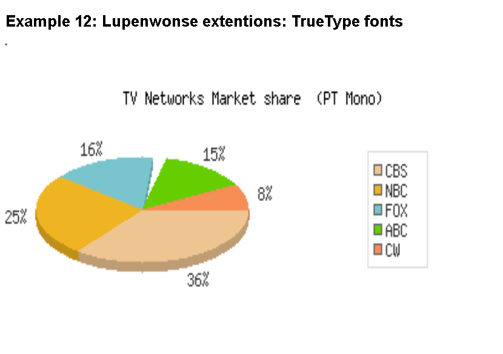

# PHPGraphLib Graphing Library
### Fork motivation
This is a fork from elliotb/phpgraphlib
PHPGraphLib was no longer maintained and not functional with PHP 7.x and up
Plus I added some additions of my own some years ago.
Looking for solution for some PHP 7.x issues I found the repo at Github
Github user 'LupenWonse' did already fix many of the issues, and he added TrueType font support.

## Releases
*  2.0-legacy-stable release is the last release by Elliotb
*  v3.0 is PHP 7.x compatible (not true, only for line graphs ! )

## Planned releases
*  v3.1 will includes fixes and additions:
Fixes:
* LupenWonse : all remaining PHP 7 fixes found in his latest release are included
* OldChris : function allocateGradientColors() checked on boundaries of rgb values

Additions:
* LupenWonse added TrueType fonts
* OldChris added copyright text and creationdate, x-axis title, y-axis title.
  also some changes in fontsize calculations (font width and height calculated from font size) 

The text below will be updated and demos will be restored if possible. I will also try to recreate the documentation.
On this link an web archive of the documentation is stored:
[Documentation on Web Archive](https://web.archive.org/web/20180121185935/http://www.ebrueggeman.com/phpgraphlib/documentation)

Thank you.
Chris van Gorp (OldChris)

### PHPGraphLib is a lightweight PHP-based graphing library that creates slick PHP graphs for incorporation into a website or application.

PHPGraphLib has powerful customization features, allowing you to generate the perfect bar, line, stacked bar, or pie graph for any application. Used with dynamic data, PHPGraphLib allows easy visual interpretation of sophisticated data sets. Simply feed PHPGraphLib an array of data points, and it will generate a .png chart of your data dynamically for browser display or saved to your filesystem.

### History

The first version PHPGraphLib was written in 2007 by Elliott Brueggeman to deliver PHP generated graphs quickly and easily to PHP4 applications. It has grown in both features and maturity since its inception. PHPGraphLib now requires PHP5+. Originally available only for paid commercial use, PHPGraphLib was open-sourced in 2013 under the MIT License. ~~Please visit [http://www.ebrueggeman.com/phpgraphlib](http://www.ebrueggeman.com/phpgraphlib) for more information.~~

### Documentation

For now please use this webarchive
[Documentation on Web Archive](https://web.archive.org/web/20180121185935/http://www.ebrueggeman.com/phpgraphlib/documentation)

### Examples

Within the [Examples](/examples) directory are examples of PHPGraphLib usage. Git clone this repo to a directory on your localhost or server to see these examples in action.

